# Daten-Fluss — Poll-Approval-Flow

Kanonischer End-to-End-Pfad: User submittet Poll → Admin reviewt → Approval → 4 Sofort-Notifications + Bulk-Notification an alle interessierten User.

```mermaid
flowchart LR
  User[User-Submit\nFilament-Form] --> Create[CreateMyPoll::handleRecordCreation]
  Create --> Validator[Validator::make]
  Validator --> Model[Poll::create + Questions]
  Model --> Obs[MyPollObserver::updated]
  Obs --> Admin[Notification::send to Admins]
  Admin --> Approve[Admin clicks Approve\nin AllPollsResource]
  Approve --> ApproveFn[Poll::approve]
  ApproveFn --> Update[update published_at + closes_at]
  Update --> Dispatch4[4x dispatch:\nEmail/Pr0gramm/Discord/Telegram\nto Owner]
  Update --> Loop[foreach interested User]
  Loop --> DispatchN[SendNewPollAvailable*Notification::dispatch]
  DispatchN --> Horizon[(Horizon Redis Queue\n5 workers, 60s timeout)]
  Horizon --> Job[Job::handle]
  Job --> CheckTG[userIsWithinTargetGroup]
  CheckTG --> SendNotif[Notification::route + notify]
  SendNotif --> External[Mail / pr0gramm-API / Discord / Telegram]
```



## Schritt für Schritt

### 1. Form-Submit

`app/Filament/Resources/MyPollResource/Pages/CreateMyPoll.php` — Filament-Page handlet Record-Creation:

```php
try {
    $validatedQuestions = Validator::make($questions->toArray(), [
        '*.title' => 'required|string',
        '*.question_type_id' => 'required|exists:question_types,id',
        '*.options' => 'array|present',
        '*.options.*.title' => 'required|string',
    ])->validated();

    $poll = static::getModel()::create($data);
    $poll->questions()->createMany($validatedQuestions);

} catch (\Illuminate\Validation\ValidationException $e) {
    Notification::make()
        ->title('Komisch. Beim Validieren deiner Fragen ist ein Fehler aufgetreten.')
        ->danger()
        ->send();
}
```

Keine FormRequest-Klasse — Validation direkt im Page-Handler.

### 2. Model-Persistierung + Observer

`app/Models/Polls/MyPoll.php` triggert `MyPollObserver::updated()`:

```php
public function updated(MyPoll $poll): void
{
    if ($poll->isDirty('in_review')) {
        Notification::send($adminUsers, new PollNeedsReview($poll));
    }
}
```

Sync-Notification an Admin-Collection — kein Job-Dispatch hier.

### 3. Admin-Approval

`app/Models/Abstracts/Poll.php::approve()` (~Z.137-163) wird durch Filament-Action getriggert:

```php
public function approve(): void
{
    $this->update([
        'approved' => true,
        'in_review' => false,
        'visible_to_public' => true,
        'published_at' => now(),
        'closes_at' => now()->add($this->closes_after),
    ]);

    SendPollAcceptedEmailNotification::dispatch($this, $this->user);
    SendPollAcceptedPr0grammNotification::dispatch($this, $this->user);
    SendPollPublishedDiscordNotification::dispatch($this);
    SendPollAcceptedTelegramNotification::dispatch($this);

    foreach ($this->getInterestedUsersForChannel('mail') as $user) {
        SendNewPollAvailableEmailNotification::dispatch($this, $user);
    }
    foreach ($this->getInterestedUsersForChannel('pr0gramm') as $user) {
        SendNewPollAvailablePr0grammNotification::dispatch($this, $user);
    }
}
```

`now()->add($this->closes_after)` rechnet Carbon mit ClosesAfter-Enum-String (z.B. `"+1 week"`).

### 4. Job läuft auf Horizon

Job-Pattern uniform in allen 11 Jobs unter `app/Jobs/`:

```php
class SendNewPollAvailableEmailNotification implements ShouldQueue
{
    use Dispatchable, InteractsWithQueue, Queueable, SerializesModels;

    public int $tries = 15;
    public int $backoff = 120;

    public function handle(): void
    {
        if ($this->poll->userIsWithinTargetGroup($this->user) === false) {
            return;
        }
        Notification::route('mail', [$this->user->email => $this->user->name])
            ->notify(new NewPollAvailableEmailNotification($this->poll));
    }
}
```

Wichtige Eigenschaften: Connection `redis`, Queue `default`, max 5 parallele Worker (config/horizon.php), 60s Job-Timeout (Horizon-Config), 15 Retries × 120s = 30min Maximal-Versuchszeit.

`Telegram`-Job ist zusätzlich `ShouldBeUnique` — verhindert Duplikate über Redis-Cache.

### 5. External-Send

Mail via Laravel-Mailer → SMTP/Postmark. Pr0gramm via custom Channel (`tschucki/laravel-notification-channel-pr0gramm`). Discord/Telegram über jeweilige Notification-Channels.

## Alternativer Flow — User-Poll-Participation

```mermaid
flowchart LR
  Browse[/pr0p0ll/teilnehmen] --> Resource[PublicPollsResource]
  Resource --> Form[PollParticipation Page]
  Form --> Submit[Answer::create per Question]
  Submit --> Aggregate[PollResultService.aggregate]
```

User antwortet via Filament-Page; Answer ist polymorph (`answerable_type/answerable_id` → BoolAnswer/TextAnswer/etc.). Unique-Constraint `(poll_id, question_id, user_id, anonymous_user_id)` verhindert Mehrfach-Stimmen.

<!-- research:cross-refs-start -->

## Cross-references

Read alongside this file:

- `02-conventions/api-and-routing.md` — die Eintrittsseite des Flows
- `02-conventions/error-handling.md` — wie Errors an jedem Schritt fließen
- `02-conventions/async-and-concurrency.md` — der Job-Teil des Flows
- `03-dependencies/usage/horizon.md` — die Queue-Mechanik dahinter

<!-- research:cross-refs-end -->
